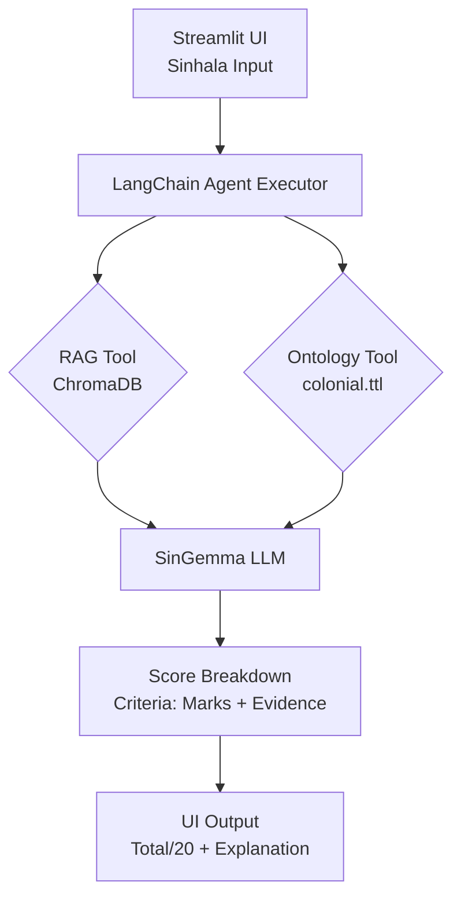

# Offline Sinhala Open-Ended Answer Scorer (Colonial Sri Lanka)

Fully **offline** intelligent system scoring Sinhala answers on **Colonial Sri Lanka (Portuguese→Dutch→British)** using **Ollama (SinGemma)** + **RAG** + **RDF Ontology** + **LangChain Agents** + **Streamlit UI**. Grades out of 20 with explainable breakdowns per marking guide [file:1].

## 🎯 Features
- **5 Sinhala questions** on Portuguese/Dutch/British eras
- **RAG retrieval** from local knowledge base (ChromaDB + LlamaIndex)
- **Ontology validation** (RDF/OWL for era relations, events)
- **Agent workflow**: Retrieve → Score → Explain marks/criteria
- **Streamlit UI** for question selection + instant scoring
- **100% Offline** - No internet required after setup

## 📋 Demo

*Score breakdown example for Portuguese era question*

## 🚀 Quick Start

1. **Install Ollama**: [ollama.com](https://ollama.com)
   ```bash
   ollama serve
   ollama pull Tharusha_Dilhara_Jayadeera/singemma:latest
   ollama pull nomic-embed-text
   ```

2. **Clone & Install**
   ```bash
   git clone <your-repo>
   cd sinhala_scorer
   pip install -r requirements.txt
   ```

3. **Build Knowledge Base**
   ```bash
   # Add your colonial MD files to knowledge/
   python build_index.py  # Creates chroma_db/
   ```

4. **Run Offline**
   ```bash
   streamlit run app.py
   ```

## 🏗️ Architecture Flowchart

## 📁 Structure

sinhala_scorer/
├── app.py # Streamlit UI
├── rag.py # RAG pipeline
├── agents.py # LangChain agents + tools
├── ontology.py # RDF ontology builder
├── questions.py # 5 questions + marking guides
├── knowledge/ # Colonial era MD files
├── colonial.ttl # RDF ontology
├── chroma_db/ # Vector store (auto-generated)
├── requirements.txt
└── screenshots/

## 📊 Sample Questions (Option 2: Colonial)
1. පෘතුගීසි යුගයේ ආර්ථික බලපෑම් (Events:8, Economy:6, Social:6)
2. ලන්දෙසි පාලනයේ නීති ප්‍රතිසංස්කරණ (etc.)

## 🔒 Offline Proof
- No API calls - Pure local Ollama inference
- ChromaDB persistent storage
- RDF ontology file-based

## Assignment Compliance
✅ **RAG (15 marks)**: LlamaIndex + ChromaDB  
✅ **Ontology (15 marks)**: RDF relations used in scoring  
✅ **Agents (15 marks)**: Tool-calling workflow  
✅ **Explainability (20 marks)**: Criteria breakdown + evidence  
✅ **Streamlit UI (5 marks)**: Clear Sinhala interface [file:1]

**Video Demo**: [Offline execution](https://your-video-link)

---
MIT License
